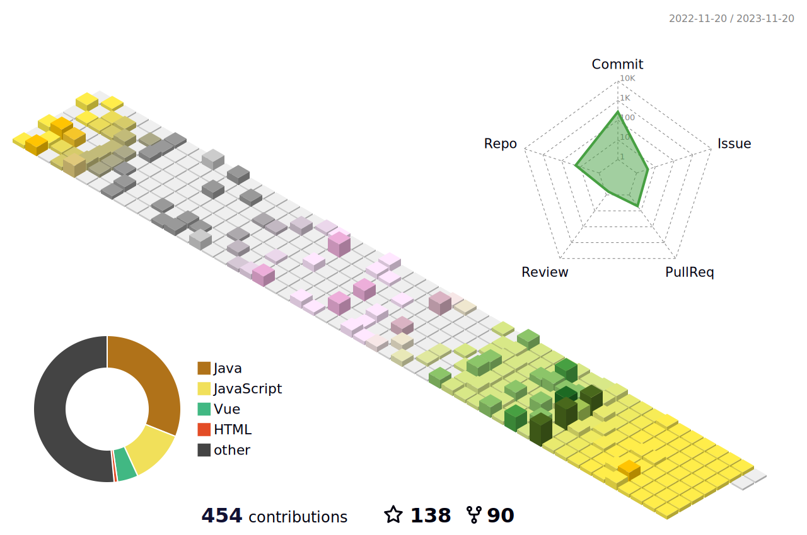

		

	<h3>📚 Tech Stack 📚</h3>
	
✨ Platforms & Languages ✨

	
	
	
	
	
	 
	
	
	
	
	 
	
	
	
	

 

	
🛠 Tools 🛠

	
	
	 
	
	
	
	
	

 

	
🨠SNS & Portfolio ğŸ¨

	
	
	
	
	 

	 

 

🆠Baekjoon solved rank ğŸ†

	

 

